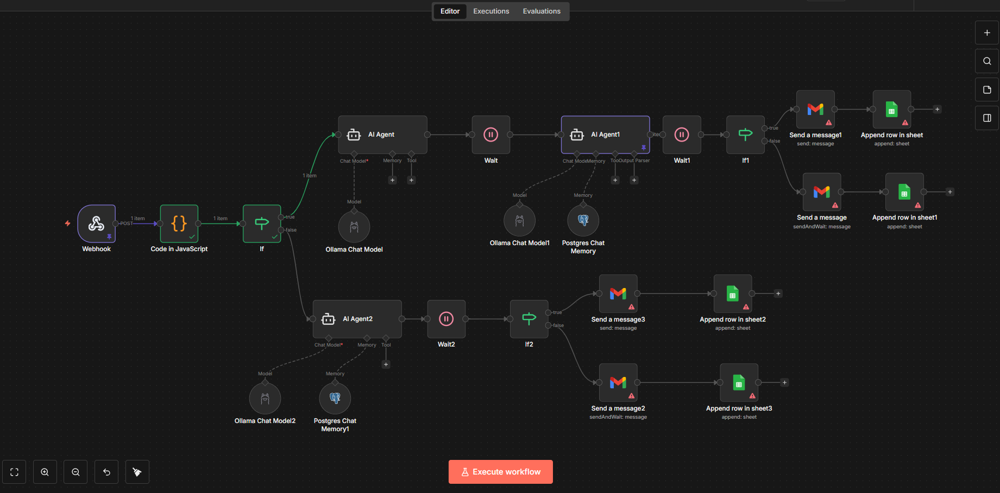

# n8n Workflow — Lead Qualification & AI Email Response ⚡️

## 🔧 Overview

This n8n workflow automates lead qualification and generates a personalized AI response for Sarah Chen (business coach). It:

- Triggers when a new form submission arrives via a **Webhook** (`Webhook` node).
- Qualifies leads using revenue and challenge length (`Code in JavaScript` + `If` node).
- Generates a personalized email with an AI agent for **QUALIFIED** leads and a polite decline for **NOT QUALIFIED** leads.
- Sends emails (Gmail) and logs rows to Google Sheets.

> Workflow source: `AIrecruitmentpatnerInterview.json` (open this to inspect nodes and connections).

---

## 📥 Incoming Payload (example)

```json
{
  "name": "John Smith",
  "email": "john@example.com",
  "business_type": "Marketing Agency",
  "monthly_revenue": "$15,000",
  "biggest_challenge": "I can't seem to break past $20k/month. I'm doing everything myself and working 60+ hours a week. I know I need to hire but I'm scared to take the leap.",
  "how_did_you_hear": "Instagram",
  "phone": "555-123-4567"
}
```

---

## ✅ Qualification Rules

Implemented in the `Code in JavaScript` node (formatting + counts) then evaluated by the `If` node.

- **QUALIFIED** if:
  - parsed `monthly_revenue` > 10,000 AND
  - `biggest_challenge` length (non-space chars) > 50

- **NOT QUALIFIED** if:
  - revenue ≤ 10,000 OR
  - challenge response too short

Important: The code node converts `"$15,000"` → `15000` and counts characters excluding whitespace.

---

## 🧠 AI Generation

Nodes used: `AI Agent` (prompt generation) + model nodes (e.g., Ollama/OpenAI configured in your n8n).

- **Qualified** flow: Prompt built to acknowledge the specific challenge, position Sarah as the solution, and include a soft CTA to book a call. The AI output becomes the email body.
- **Not qualified** flow: AI generates a short, polite decline and a friendly nurture note.

Sample AI prompt (stored in `AI Agent`):
> "Generate a prompt for email generation where the email should acknowledge the {{ $json.biggest_challenge }}, position Sarah as the solution, and include a soft CTA to book a call. Use {{ $json.business_type }} to better inform how Sarah can help increase {{ $json.monthly_revenue }}"

---

## 📨 Outputs & Storage

For every submission we capture and/or output:

- `name` (string)
- `email` (string)
- `qualification_status` (QUALIFIED / NOT QUALIFIED)
- `ai_response` (generated email body)

Actions in the workflow:

- Send email via `Send a message` (Gmail)
- Append lead + status + AI text to Google Sheets (`Append row in sheet*` nodes)
- Store conversation memory in Postgres-memory nodes (optional)

---

## 🧪 How to Test (Local n8n)

1. Start n8n and make sure the workflow is active. Note the webhook path in the `Webhook` node (example: `/webhook/c0df1ab9-d280-...`).
2. Send a test POST request:

```bash
curl -X POST \
  https://your-n8n.example/webhook/c0df1ab9-d280-471c-b0ed-b4462efe35c5 \
  -H 'Content-Type: application/json' \
  -d '{
    "name":"John Smith",
    "email":"john@example.com",
    "business_type":"Marketing Agency",
    "monthly_revenue":"$15,000",
    "biggest_challenge":"I can't seem to break past $20k/month. I'm doing everything myself and working 60+ hours a week. I know I need to hire but I'm scared to take the leap.",
    "how_did_you_hear":"Instagram",
    "phone":"555-123-4567"
  }'
```

1. Inspect the workflow run and the final outgoing email in the `Send a message` node.

---

## 🔐 Required Credentials / Nodes

- `Webhook` (built-in)
- `Code` node (JS) — included in the workflow
- AI integration: Ollama / OpenAI or other LLM nodes (configured in `AI Agent` and model nodes)
- Gmail OAuth2 credential (for `Send a message` nodes)
- Google Sheets (append rows)
- Postgres (optional, for memory)

---

## ✅ Example Outputs

**Qualified** email body (example):

> Hi John,
>
> Thanks for sharing so honestly — I can tell you’re overwhelmed juggling everything and that hiring feels risky right now. I’ve helped Marketing Agencies like yours build hiring systems that let them move from doing everything themselves to leading a consistent, trained team — without sacrificing revenue or control. I’d love to share one or two simple steps you can take this week to start scaling. Would you be open to a 20-minute call to explore this?
>
> Warmly,  
> Sarah Chen

**Not qualified** message (example):

> Hi [Name],
>
> Thanks for reaching out. At this time we’re focusing on clients with established revenue above our threshold, but we’d love to stay in touch and share resources to help you grow. Will add you to our nurture list.
>
> Best,  
> Sarah

---

## 📸 Final Output Preview



## 📈 Workflow Diagram



---

If you want, I can also export a visual diagram of the workflow or create a ready-to-import n8n workflow file with sanitized credentials. 🔧
